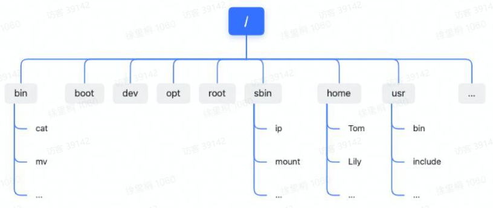
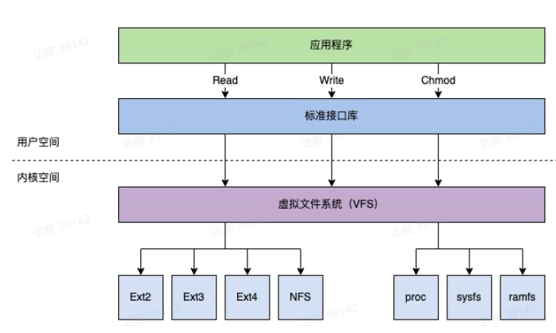
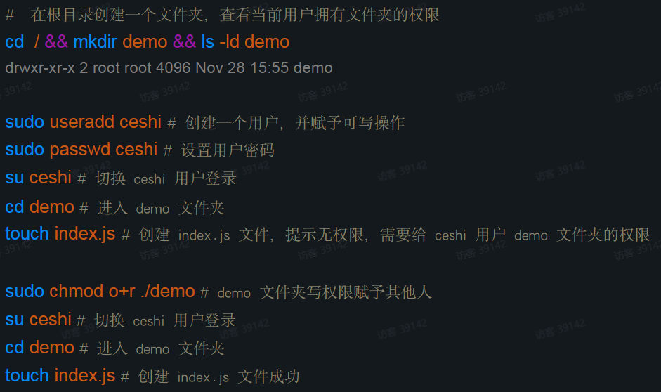
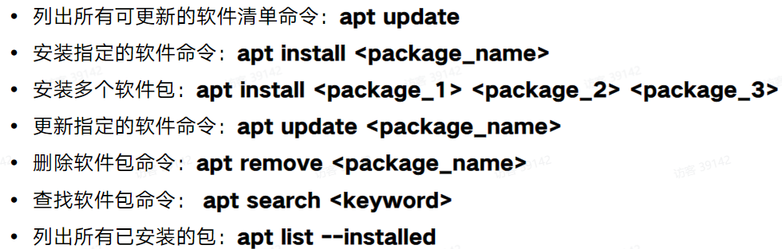

https://bytedance.larkoffice.com/file/H9JGbU3jMoe23AxopbYcDVJcnHx

## Linux 基础

查看Linux系统内核版本

```bash
# 方法 1
uname -a

# 方法 2
cat /proc/version

# 方法 3
cat /etc/os-release
```

### Linux系统应用领域

- IT服务器（操作系统、虚拟化和云计算）
- 嵌入式和智能设备
- 个人办公桌面
- 学术研究与软件研发

### Liunx系统结构

- 内核
- shell
- 文件系统
- 应用程序

·内核是硬件与软件之间的中间
层
·内核是一个资源管理程序
·内核提供一组面向系统的命令

#### **进程管理**

- 进程是正在执行的一个程序或命令
- 进程有自己的地址空间，占用一定的系统资源
- 一个CPU核同一时间只能运行一个进程
- 进程由它的进程ID(PID)和它父进程的进程PID(PPID)唯一识别


查看进程信息

```bash
# 查看启动的nginx进程
ps -ef | grep nginx

# 查看某个进程
top -p 32434

# 关闭指定进程
kill -9 32434

# 全部进程动态实时视图
top
```

**进程调度**

>进程调度是指操作系统按某种策略或规则选择进程占用CPU进行运行的过程。


进程调度算法

- 一个CPU核同一时间只能运行一个进程
- 每个进程有近乎相等的执行时间
- 对于逻辑CPU而言进程调度使用轮询的方式执行，当轮询完成则回到第一个进程反复
- 进程执行消耗时间和进程量成正比

进程间的系统调用

内核空间(Kernal Space):系统内核运行的空间
用户空间(User Space):应用程序运行的空间

#### **文件系统**

文件系统负责管理持久化数据的子系统，负责把用户的文件存到磁盘硬件中

Liux文件系统是采用树状的目录结构,最上层是/(根)目录



虚拟文件系统(VFS)
- 对应用层提供一个标准的文件操作接口
- 对文件系统提供一个标准的文件接入接口



```bash
# df 命令报告文件系统磁盘空间利用率
df -T 

# mount 命令是挂载文件系统用的，不带任何参数运行，会打印包含文件系统类型在内的磁盘分区的信息
mount

ls # 列出当前目录下的文件

mkdir demo # 创建文件夹

touch demo.txt # 创建文件

rm -r demo # 删除文件夹

mv demo /home # 移动文件夹

cp demo.txt demo_bak.txt # 复制文件
```

#### **用户权限**

- 用户账户  
普通用户账户：在系统中进行普通  
超级用户账户：在系统中对普通用户和整个系统进行管理
- 用户组  
标准组：可以容纳多个用户  
私有组：只有用户白己

文件权限关于用户有三个概念：

所有者：文件的所有者  
所在组：文件的所有者所在的组  
其他人：除文件所有者及所在组外的其他人  
每个用户对于文件都有不同权限，包括读(R)、写(W)、执行(X)


查看用户信息

```bash
w # 查看当前登录用户信息

whoami # 查看当前用户

groups # 查看当前用户所在的组

id xxx # 查看当前用户的uid信息

```



#### 软件包管理

软件包  
通常指的是一个应用程序，它可以是一个GU‖应用程序、命令行工具或(其他软件程序需要的
)软件库

软件包管理  
- 底层工具：主要用来处理安装和删除软件包文件等任务，DPKG,RPM
- 上层工具：主要用于数据的搜索任务和依赖解析任务，APT,YUM,DNF

debian apt常用命令



软件源配置 `/atc/apt/sources.list`

镜像地址：https:/mirrors.aliyun.com/  
/dists:查看系统代号  
/poo:查看软件分支  

```bash
apt update # 更新包缓存

apt install nginx # 安装nginx

whereis nginx # 查看nginx位置 /etc/nginx 配置文件路径 /usr/sbin/nginx 可执行文件

curl http://localhost:80 # 测试nginx默认站点

sudo /usr/sbin/nginx -s stop # 停止nginx

sudo /usr/sbin/nginx # 启动nginx

cd /etc/nginx # 进入nginx配置文件夹

cat nginx.conf # 查看nginx配置文件

cd /sites-available && vim default # 进入nginx配置文件,并进行编辑

sudo /usr/sbin/nginx -s reload # 重启nginx

curl http://localhost:8080
```