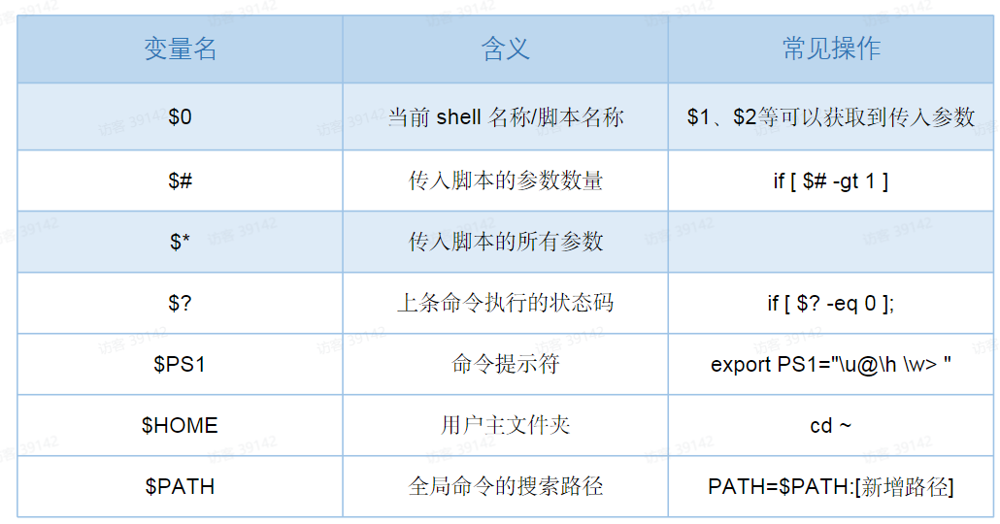
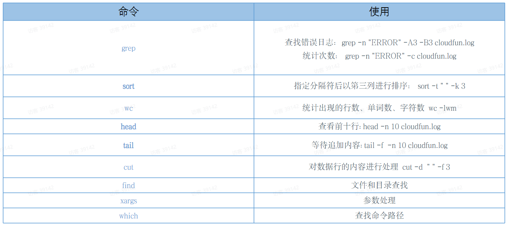

# Shell

## shell 基础和语法

### 变量

```bash
#!/bin/bash

# 变量名=变量值
page_size=1
page_num=2

# 将命令赋值给变量
_ls=ls

# 将命令结果赋值给变量
file_list=$(ls -a)

# 默认字符串 不会进行+运算
total=page_size*page_num

# 声明变量为整型
let total=page_size*page_num
declare -i total=page_size*page_num

# 导出环境变量
export total
declare -x total
```

### 系统环境变量
  

### 管道
>管道与管道符|，作用是将前一个命令的结果传递给后面的命令 cmd1 | cmd2
>管道右侧的命令必须能接受标准输入才行，比如grep命令，ls、mv等不能直接使用，可以使用xargs预处理
>管道命令仅仅处理stdout,对于stderr会予以忽略，
可以使用set-o pipefail设置shell遇到管道错误退出

```bash
cat palterform.access.log | grep ERROR

netstat -an | grep ESTABLISHED | wc -l

find . -maxdepth 1 -name "*.sh" | xargs ls -l
```


### 重定向

输出重定向符号  
\>:覆盖写入文件  
\>>:追加写入文件  
2>:错误输出写入文件  
&>:正确和错误输出统一写入到文件中  

输入重定向符号  
<  
<<  


```bash
ls -l >> list.txt 2>&1
cat list.txt

while read -r line; do echo $line | cut -d " " -f 1 | xargs >> auth.txt; done < ./list.txt

cat auth.txt

wc -l <<EOF
```

### 判断命令

>shell中提供了`test、[、[[`三种判断符号，可用于：整数测试、字符串测试、文件测试
```bash
test condition
[ condition ]
[[ condition ]]

```
注意：

- 中括号前后要有空格符
- \[和test是命令，只能使用自己支持的标志位，`<、>、=`只能用来比较字符串
- 中括号内的变量，最好都是用引号括起来
- [[更丰富，在整型比较中支持`<、>、=`，在字符串比较中支持`=~`正则

1、常用判断条件  
(1) 两个整数之间比较

= 字符串比较  
-lt 小于(less than)  
-le 小于等于(less equal)  
-eq 等于(equal)  
-ne 不等于(Not equal)  
-gt 大于(greater than)  
-ge 大于等于(greater equal)  

(2) 按顺文件权限进行判断  
-r 有读的权限(read)  
-w 有写的权限(write)  
-x 有执行的权限(execute)  
(3) 按顺文件关型进行判断  
-f 文件存在并且是一个常规的文件(file)  
-e 文件存在(existence)  
-d 文件存在并是一个目录(directory)  

2 、练习实操
(1) 逻辑语句 && 和 ||
&& 前面条件成立，后面语句才会执行（逻辑与）
|| 前面条件不成立，后面语句才会执行（逻辑或）

```bash
cat demo.sh

#!/bin/bash
# && 逻辑与 和 逻辑或
echo $#
[ $# -gt 2 ] && echo "参数的个数大于2"
[ $# -lt 2 ] || echo "参数的个数大于2----"

sh demo.sh 1 2 3
3
参数的个数大于2
参数的个数大于2----

sh demo.sh 1 2
2
参数的个数大于2----

sh demo.sh 1
1

```

(2) 利用命令的执行结果进行判断
判断用户是否存在，创建用户

参考：`echo $?` 输出的0 和 1 ,表示Y 与 F

```bash
#!/bin/bash
#如果用户zhangsan不存在，则添加用户zhangsan
id zhangsan &> /dev/null && echo "zhangsan用户存在，不用添加"
id zhangsan &> /dev/null || useradd zhangsan

```

### 流程控制
1、if 判断
基本格式
>注意事项: (1) [ 条件判断式 ]，中括号和条件判断式之间必须有空格
(2) if后要有空格

```bash
if [ 条件判断句 ];then
    程序
fi
​
#或者
​
if [ 条件判断句 ]
    then
    程序
fi

```

案例：判断年龄

```bash
[root@clb1 shell]# cat if.sh
#!/bin/bash
if [ $1 -lt 18 ];then
    echo "未成年"
elif [ $1 -ge 18 -a $1 -le 30 ];then
    echo "青年"
else
    echo "中老年"
fi
[root@clb1 shell]# sh if.sh 22
青年
[root@clb1 shell]# sh if.sh 33
中老年
[root@clb1 shell]# sh if.sh 3
未成年

```
2、case语句
>注意事项
1. case行尾必须为单词“in"，每一个模式匹配必须以右括号 )结束

2. 双分号 ;; 表示命令序列结束，相当于java中的break。

3. 最后的*)表示默认模式，相当于java中的default。

```bash
case $变量名 in
  “值1”)
    如果变呈的值等于值1，则执行程序1
    ;;
  “值2”)
    如果变星的值等于值2，则执行程序2
    ;;
  *)
    如果变量的值都不是以上的值，则执行此程序
    ;;
esac
```

案例：判断输入

```bash
[root@clb1 shell]# cat case.sh
#!/bin/bash
case $1 in
"start")
    echo "你输入的是start"
;;
"stop")
    echo "你输入的是stop"
;;
*)
    echo "你输入的是其他"
;;
esac
[root@clb1 shell]# sh case.sh stop
你输入的是stop
[root@clb1 shell]# sh case.sh start
你输入的是start
[root@clb1 shell]# sh case.sh st
你输入的是其他

```

3、循环

- while循环
while condition;do 程序段；done
- until循环
until condition;do 程序段；done
- for循环
for var in [words..];do 程序段；done

### 函数

```bash
printName(){

if [ $# -1t 2 ]; then
  echo "illegal parameter."
  exit 1
fi
  echo "firstname is: $1"
  echo "lastname is: $2"
}
printName jacky chen
```
注意

- shell自上而下执行，函数必须在使用前定义
- 函数获取变量和shell script类似，$0代表函数名，后续参数通过$1、$2..获取
- 函数内return仅仅表示函数执行状态，不代表函数执行结果
- 返回结果一般使用echo、printf,在外面使用$0、``获取结果
- 如果没有return,函数状态是上一条命令的执行状态，存储在$？中

**模块化**

模块化的原理是在当前shell内执行函数文件，方式：
source[函数库的路径]

```bash
# math.sh
#!/bin/bash
# add函数
# @return platForm
function add(){
  declare -i res=$1+$2
  echo $res
}

#!/bin/bash
source './math.sh'
total=$(add 1 2)
echo $total
```

### 常见命令



### 执行

1、shell脚本一般以.sh结尾，也可以没有，这是一个约定；第一行需要指定用什么命令解释器来执行

```bash
#! /bin/bash
#! /usr/bin/env bash
```

2、启动方式

```bash
#文件名运行
./filename.sh

#解释器运行
bash./filename.sh

#source运行
source ./filename.sh
```

### shell展开

1. 大括号展开(Brace Expansion) `{..}`
2. 波浪号展开(Tilde Expansion) `~`
3. 参数展开(Shell Parameter Expansion)
4. 命令替换(Command Substitution)
5. 数学计算(Arithmetic Expansion) `$((..))`
6. 文件名展开(Filename Expansion) ` * ? [..]`外壳文件名模式匹配

**大括号展开**

>一般由三部分构成，前缀、一对大括号、后缀，大括号内可以是逗号分割的字符串序列，也可以是序列表达式`{x.y[..incr]}`

```bash
# 字符串序列
a{b,c,d}e=abe ace ade

# 表达式序列，（数字可以使用incr调整增量，字母不行)
{1..5} => 12345

{1..5..2} => 1 3 5

{a..e} => a b c d e
```

**波浪号展开**

```bash
# 当前用户主目录
~ => $HOME

~/f00 => $HOME/foo

# 指定用户的主目录
~fred/foo => 用户fred的$HOME/foo

# 当前工作目录
~+/foo => $PWD/foo

# 上一个工作目录
~-/foo => ${$OLDPWD-'~-'}/foo
```

**参数展开**

1. 间接参数扩展`${!parameter}`,其中引用的参数并不是parameter而是parameter的实际的值
2. 参数长度`${#parameter}`
3. 空参数处理
  `${parameter:-word} #`为空替换
  `$parameter:=word} #`为空替换，并将值赋给`$parameter`变量
  `${parameter:?word} #`为空报错
  `${parameter:+word} #`不为空替换

4. 参数切片
  `$(parameter:offset)`
  `$(parameter:offset:length)`

5. 参数部分删除
`${parameter%word}#`最小限度从后面截取word
`${parameter%%word}#`最大限度从后面截取word
`${parameteri#word}#`最小限度从前面截取word
`${parameter##word}#`最大限度从前面截取word

```bash
#/bin/sh
str=abcdefg
spl=s{str##*d)
sp2=${str%%d*}
echo $sp1 # 输出efg
 
echo $sp2 # 输出abc
```


**命令替换**

>在子进程中执行命令，并用得到的结果替换包裹的内容，形式上有两种：`$()`或\`…\`

```bash
#!/bin/bash
echo $(whoimi)
foo(){
  echo "asdasd"
}
a=foo
```

**数学计算 `$((..))`**

```bash
#!/bin/bash

echo $((1+3))
```

**文件名展开**
当有单词没有被引号包裹，且其中出现了`*`，`？`，and`[`字符，则shell会去按照正则匹配的方式查找文件名进行替换，如果没找到则保持不变。


```bash
#!/bin/bash

echo D*
#输出当前目录下所有以D字母开头的目录、文件
```


### 调试和前端集成

**调试**

1. 普通log,使用echo、printf
2. 使用set命令
3. vscode debug插件

```bash
#/bin/sh

set -uxe -o pipefail
echo "hello world"
```

| set配置 | 作用 | 补充 |
| :----: | :----: | :----: | 
| -u | 遇到不存在的变量就会报错，并停止执行 | -o nounset |
| -x | 运行结果之前，先输出执行的那一行命令 | -o xtrace |
| -e | 只要发生错误，就终止执行 | -o errexit |
| -o pipefail | 管道符链接的，只要一个子命令失败，整个管道命令就失败，脚本就会终止执
行. |  |

**vscode 插件**

1.shellman: 代码提示和自动补全   
2.shellcheck: 代码语法校验  
3.shell-format: 代码格式化    
4.Bash Debug: 支持单步调试  

- 安装vscode插件
- 编写launch.json文件
- 升级bash到4.x以上版本

```bash
# 1,安装最新版本bash
brew install bash

# 2.查看安装路径
which -a bash

# 3.将新版本bash路径加入PATH
PATH="/usr/local/bin/bash:SPATH"
# 4.配置vscode launch.json启动文件
{
  "version": "0.2.0",
  "configurations": [
    {
      "type": "bash",
      "request": "launch",
      "name": "Bash debugger",
      "args": [],
      "cwd": "${workspaceFolder}",
      "program": "${workspaceFolder}/demo.sh",
    }
  ]
}
```

**前端集成**

1. node中通过exec、spawn调用shell命令
2. shell脚本中调用node命令
3. 借助zx等库进行javascript、shell script的融合
>  - 借助shell完成系统操作，文件io、内存、磁盘系统状态查询等
>  - 借助nodejs完成应用层能力，网络io、计算等
