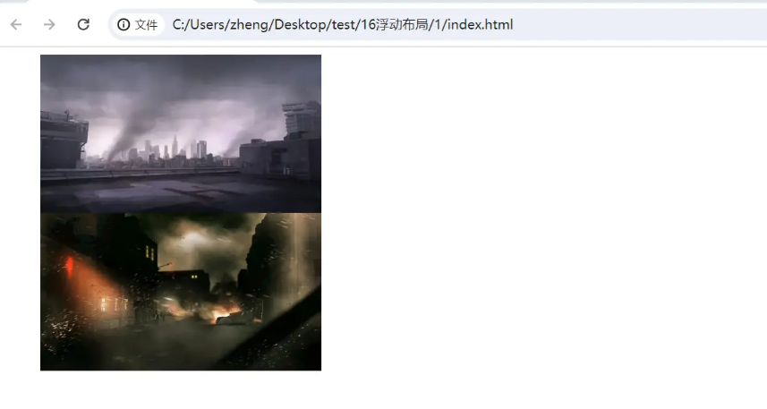
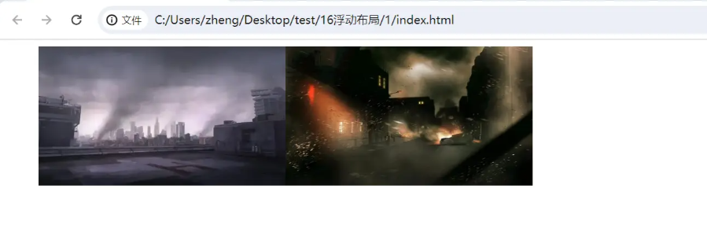
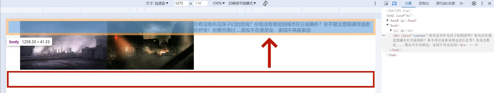
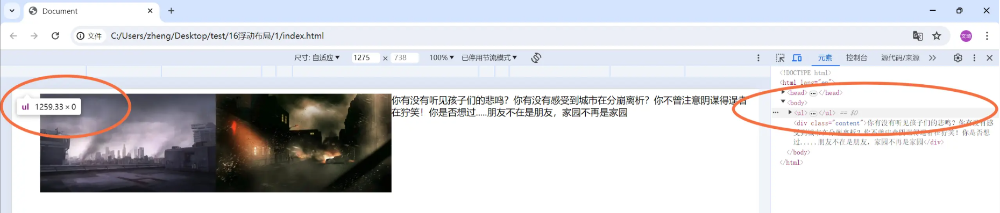
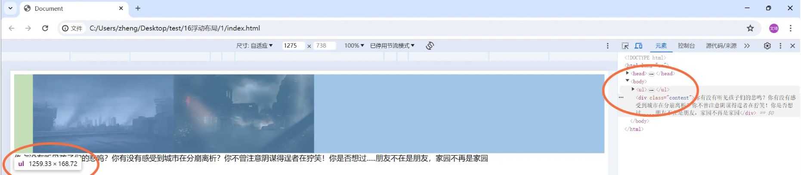

# 块级格式化上下文

## 定义

块级格式化上下文（Block Formatting Context，简称 BFC）。

（MDN）它是 Web 页面的可视 CSS 渲染的一部分，是块级盒子的布局过程发生的区域，也是浮动元素与其他元素交互的区域。

（W3C）BFC 它决定了元素如何对其内容进行定位，以及与其它元素的关系和相互作用，当涉及到可视化布局时，Block Formatting Context 提供了一个环境，HTML 在这个环境中按照一定的规则进行布局。

简单来说就是，BFC 是一个完全独立的空间（布局环境），让空间里的子元素不会影响到外面的布局。

## 浮动布局的场景模拟

```xml
  <style>
    ul{
        font-size:0;
    }
    /* 图片宽度 */
    img{
        width: 300px;
    }
  </style>

  <body>
    <ul>
        <li class="item"></li>
        <li class="item"></li>
    </ul>
  </body>

```



由于两个li都为块级元素，如果想让它们都集中在一行，那么大家最先想到的方法肯定是给ul中的每一个子项li都添加上浮动属性，于是：

```xml

  <style>
        ul{
            font-size:0;
        }
        /* 图片宽度 */
        img{
            width: 300px;
        }
        .item{
            float: left;
        }
  </style>

```



就在这时，你突然想给这两张图片添加一段文本。

按照正常流程，在ul之下添加一个名为content的div来容纳这段文本:

```xml
<body>
    <ul>
        <li class="item"></li>
        <li class="item"></li>
    </ul>
    <div class="content">你有没有听见孩子们的悲鸣？你有没有感受到城市在分崩离析？你不曾注意阴谋得逞者在狞笑！你是否想过.....朋友不在是朋友，家园不再是家园</div>
</body>
```



但就是在这个时候，由于容器ul被赋予的浮动属性，塌陷了我们预期出现在图片底部的文本。

## 各种清除浮动方法

这个时候有许多方法可以达到我们的目的，包括：

- 设置父元素的高度
- 在父元素结束之前添加一个空元素，并摄制 clear: both；
- 借助伪元素 ：：after 清除浮动
- 给后面受影响的元素设置 clear： both；
- 把父元素设置成 BFC 容器

上四点有的只是达到和清除浮动一样的效果，不能做到尽善尽美，有的甚至会产生过多冗余的代码，逐渐形成屎山，因此一般情况下不推荐使用。

## BFC的应用原理

可以看出此时ul容器中的高度为零，这是因为正常普通的容器不会把浮动元素的高度计算在内，也可以说成是不会把脱离文档流的元素高度计算在内（浮动元素脱离文档流），这就是文本塌陷的原因。



但如果我们将ul设置成BFC容器：在ul内添加上overflow:hidden这段代码，就可以解决这个问题。

```xml
   <style>
        ul{
            font-size:0;
            overflow:hidden;
        }
        /* 图片宽度 */
        img{
            width: 300px;
        }
        .item{
            float: left;
        }
  </style>
```

BFC将浮动元素的高度计算在内，我们所期望的文本回到了它该在的位置，至此，大功告成



## BFC的布局规则

- BFC 就是一个块级元素，块级元素会在垂直方向一个接一个的排列
- BFC容器内部和外部的容器相互隔离，互不影响 -- 解决margin重叠问题
- BFC容器内，垂直方向的距离由 margin 决定， 属于同一个BFC在垂直方向上的相邻元素的margin会重叠
- BFC容器在计算高度时，浮动元素也参与计算 --- 清除浮动

## 触发BFC的方式

文档的根元素（<html>）。
浮动元素（即 float 值不为 none 的元素）。
绝对定位元素（position 值为 absolute 或 fixed 的元素）。
行内块元素（display 值为 inline-block 的元素）。
表格单元格（display 值为 table-cell，HTML 表格单元格默认值）。
表格标题（display 值为 table-caption，HTML 表格标题默认值）。
匿名表格单元格元素（display 值为 table（HTML 表格默认值）、table-row（表格行默认值）、table-row-group（表格体默认值）、table-header-group（表格头部默认值）、table-footer-group（表格尾部默认值）或 inline-table）。
overflow 值不为 visible 或 clip 的块级元素。
display 值为 flow-root 的元素。
contain 值为 layout、content 或 paint 的元素。
弹性元素（display 值为 flex 或 inline-flex 元素的直接子元素），如果它们本身既不是弹性、网格也不是表格容器。
网格元素（display 值为 grid 或 inline-grid 元素的直接子元素），如果它们本身既不是弹性、网格也不是表格容器。
多列容器（column-count 或 column-width (en-US) 值不为 auto，且含有 column-count: 1 的元素）。
column-span 值为 all 的元素始终会创建一个新的格式化上下文，即使该元素没有包裹在一个多列容器中（规范变更、Chrome bug）

## BFC解决的问题

通常，我们会为定位和清除浮动创建新的 BFC，而不是更改布局，因为它将`影响布局`。

- 包含内部浮动。
- 排除外部浮动。
- 阻止外边距重叠。

### 1. 解决高度塌陷

> 使用 float 布局时元素会脱离文档流，使得容器高度没有被撑开。

为解决此问题可以给 container 触发 BFC，上面我们所说到的触发 BFC 属性都可以设置

### 2. 解决 margin 边距重叠

> 区块的上下外边距有时会合并（折叠）为单个边距，其大小为两个边距中的最大值（或如果它们相等，则仅为其中一个），这种行为称为外边距折叠。

::: tip 注意
有设定浮动和绝对定位的元素不会发生外边距折叠。
:::

#### 有三种情况会形成外边距折叠

##### 1. 相邻的兄弟元素

相邻的同级元素之间的外边距会被折叠（除非后面的元素需要清除之前的浮动）。

##### 2. 没有内容将父元素和后代元素分开

如果没有设定边框（border）、内边距（padding）、行级（inline）内容，也没有创建区块格式化上下文或间隙来分隔块级元素的上边距（margin-top）与其内一个或多个子代块级元素的上边距（margin-top）

或者没有设定边框、内边距、行级内容、高度（height）或最小高度（min-height）来分隔块级元素的下边距（margin-bottom）与其内部的一个或多个后代后代块元素的下边距（margin-bottom），则会出现这些外边距的折叠，重叠部分最终会溢出到父代元素的外面。

##### 3. 空的区块

如果块级元素没有设定边框、内边距、行级内容、高度（height）、最小高度（min-height）来分隔块级元素的上边距（margin-top）及其下边距（margin-bottom），则会出现其上下外边距的折叠。

::: warning 一些需要注意的地方：

- 上述情况的组合会产生更复杂的（超过两个外边距的）外边距折叠。
- 即使某一外边距为 0，这些规则仍然适用。因此就算父元素的外边距是 0，第一个或最后一个子元素的外边距仍然会（根据上述规则）“溢出”到父元素的外面。
- 如果包含负边距，折叠后的外边距的值为最大的正边距与最小（绝对值最大）的负边距的和。
- 如果所有的外边距都为负值，折叠后的外边距的值为最小（绝对值最大）的负边距的值。这一规则适用于相邻元素和嵌套元素。
- 外边距折叠仅与垂直方向有关。
- display 设置为 flex 或 grid 的容器中不会发生外边距折叠。
  
:::

因为`正常文档流`中建立的 BFC `不与`元素`本身所在的`块格式化上下文中的`任何浮动`的`外边距重叠`

## 参考

- [掌握外边距折叠](https://developer.mozilla.org/zh-CN/docs/Web/CSS/CSS_box_model/Mastering_margin_collapsing)
- [区块格式化上下文](https://developer.mozilla.org/zh-CN/docs/Web/CSS/CSS_display/Block_formatting_context)
- [面试官：请说说什么是 BFC？大白话讲清楚](https://juejin.cn/post/6950082193632788493)
- [清除浮动图文解析：BFC的详细概念与触发原理](https://juejin.cn/post/7372757076937064483?searchId=20250820113432301F67B04792DB5E7EE8)
