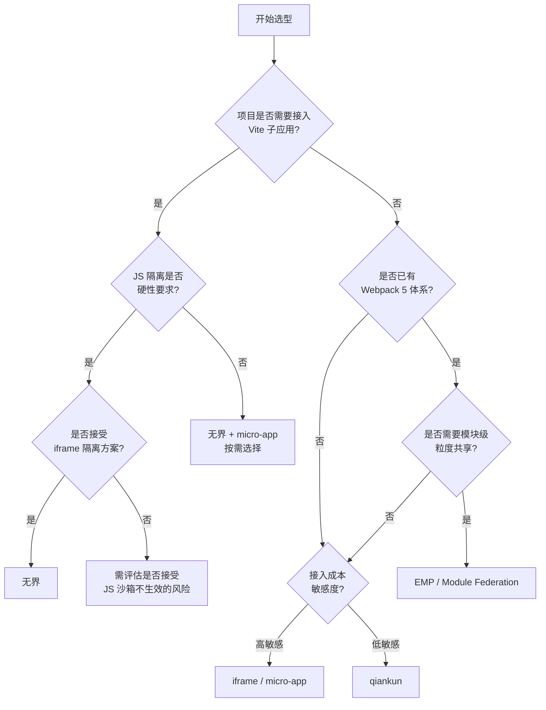

# 微前端方案对比与选型

## 一、多维度对比总览

| 维度             | iframe      | single-spa | qiankun        | micro-app      | EMP（MF）    | 无界                | Garfish    |
| ---------------- | ----------- | ---------- | -------------- | -------------- | ------------ | ------------------- | ---------- |
| **隔离方式**     | 浏览器原生  | 无隔离     | Proxy 沙箱     | Proxy 沙箱     | 无沙箱       | iframe + Shadow DOM | Proxy 沙箱 |
| **JS 隔离**      | 完美        | 无         | 较好           | 较好           | 弱（靠规范） | 较好                | 较好       |
| **CSS 隔离**     | 完美        | 无         | Strict/Scoped  | 自定义前缀     | 弱（靠规范） | Shadow DOM          | Scoped     |
| **接入成本**     | 低          | 高         | 高             | 中             | 高           | 低                  | 中         |
| **Vite 支持**    | 原生支持    | 不直接支持 | 不直接支持     | 需 plugin 改造 | 不支持       | 原生支持            | 不直接支持 |
| **子应用保活**   | 支持        | 不支持     | 不支持         | 支持           | 不支持       | 支持                | 不支持     |
| **多应用激活**   | 支持        | 支持       | 不支持         | 支持           | 支持         | 支持                | 支持       |
| **性能**         | 内存消耗大  | 无额外开销 | 沙箱有性能开销 | 较好           | 好           | 好                  | 较好       |
| **通信机制**     | postMessage | 无内置     | 全局状态       | 全局状态       | 模块共享     | Proxy 通信          | 全局状态   |
| **Webpack 依赖** | 无          | 无         | 弱             | 弱             | 强依赖       | 无                  | 弱         |
| **浏览器兼容**   | 完美        | IE11+      | IE11+          | Chrome 67+     | Chrome 80+   | Chrome 67+          | IE11+      |
| **社区活跃度**   | N/A         | 中         | 高             | 中             | 中           | 中                  | 中         |
| **维护方**       | W3C 标准    | 社区       | 阿里           | 京东           | Webpack 团队 | 腾讯                | 字节跳动   |

---

## 二、各方案深度评价

### 2.1 iframe

**适用范围**：对 UI 交互一致性要求不高的后台管理系统子系统嵌入，或纯粹的文档/报表类应用嵌套。

**核心风险**：

- DOM 割裂导致弹窗、下拉菜单等浮层组件的用户体验极差
- URL 不同步导致浏览器前进后退失效
- 每个 iframe 是一个完整的浏览器上下文，内存开销大

### 2.2 qiankun

**适用范围**：React/Vue 技术体系的传统 Webpack 构建项目，对稳定性要求高的中大型项目。

**核心风险**：

- 不能同时激活多个子应用（同一时刻只能有一个子应用处于激活状态）
- Vite 等 ESM 打包工具的适配不完善
- 沙箱在某些场景下有性能衰减
- 升级维护趋于停滞，2023 年后更新频率明显降低

### 2.3 micro-app

**适用范围**：需要子应用保活、多应用同时激活的场景，以及希望接入成本相对较低的 Webpack 项目。

**核心风险**：

- Vite 子应用仍需插件适配，且 vite 模式下 JS 沙箱不生效
- CSS 隔离基于属性前缀方案，仍存在穿透风险
- 对 Web Components 有浏览器兼容性要求

### 2.4 EMP / Webpack 5 Module Federation

**适用范围**：团队技术栈统一且都基于 Webpack 5，需要模块级别共享的协作场景，如组件库/工具库的跨项目共享。

**核心风险**：

- 强依赖 Webpack 5，无法接入非 Webpack 项目
- JS 和 CSS 缺乏有效的运行时隔离机制，依赖团队规范约束
- 对老旧 Webpack 项目迁移成本极高
- 主应用与子应用路由可能冲突

### 2.5 无界微前端

**适用范围**：追求低接入成本和良好隔离性的项目，支持 Vite/Webpack 多种构建工具的新建项目。

**核心风险**：

- 使用空的 iframe 做 JS 沙箱，初始化存在时序问题（使用定时器轮询等待）
- 子应用的 axios 等依赖浏览器环境的库需要自行适配
- 相对较新，社区生态和踩坑经验相对较少

### 2.6 single-spa

**适用范围**：团队工程能力较强，仅需路由调度，能自行解决隔离和通信问题的场景；或作为其他微前端框架的底层依赖。

**核心风险**：

- 无任何隔离能力，JS/CSS 冲突需子应用严格遵守规范
- JS Entry 方式要求子应用打包为 UMD 格式，不支持 Vite
- 无内置通信方案，需自行实现
- 接入成本高，子应用需要大量适配工作

### 2.7 Web Components（原生方案）

**适用范围**：对框架零依赖有要求的场景，或作为 micro-app 等方案的底层实现基础。

**核心风险**：

- 不是完整的微前端框架，仅提供组件封装能力
- 缺少路由调度、生命周期管理、通信机制等微前端必备能力
- Shadow DOM 与部分第三方 UI 库（弹窗组件）兼容性差
- 需要自行实现应用级别的加载和卸载逻辑

### 2.8 Garfish

**适用范围**：字节跳动内部大量微前端场景的实践产物，适合需要路由劫持 + 沙箱隔离的 Webpack 项目。

**核心风险**：

- 社区生态相对较小，文档和外部案例较少
- Vite 支持不完善
- 与 qiankun 功能重叠，差异化不明显
- 字节内部维护为主，社区贡献度有限

---

## 三、选型决策树

---

## 四、场景推荐矩阵

| 场景                | 推荐方案          | 原因                              |
| ------------------- | ----------------- | --------------------------------- |
| 新项目、技术栈不限  | 无界              | 接入成本最低、隔离性好、支持 Vite |
| 老 Webpack 项目改造 | qiankun           | 社区成熟、踩坑经验丰富            |
| 需要子应用保活      | micro-app / 无界  | 两者都原生支持保活                |
| 多技术栈混合        | 无界 / iframe     | 对技术栈限制最少                  |
| 组件/模块跨项目共享 | EMP（MF）         | 模块联邦为此而生                  |
| 简单后台嵌入        | iframe            | 最简单、隔离最完美                |
| 自研微前端框架      | single-spa        | 极简内核，可在此基础上二次封装    |
| 需要兼容 IE11       | qiankun / Garfish | 都支持 IE11                       |
| 字节系技术栈        | Garfish           | 内部实践丰富，生态一致            |

---

## 五、迁移成本评估

| 方案           | 主应用改造量     | 子应用改造量 | 总体迁移成本 |
| -------------- | ---------------- | ------------ | ------------ |
| iframe         | 低               | 低           | 低           |
| single-spa     | 中               | 高           | 高           |
| qiankun        | 中               | 高           | 高           |
| micro-app      | 中               | 中           | 中           |
| EMP（MF）      | 高               | 高           | 高           |
| 无界           | 低               | 低           | 低           |
| Garfish        | 中               | 中           | 中           |
| Web Components | 高（需自建框架） | 高           | 极高         |

> 迁移成本不仅包括代码改造，还包括团队学习曲线、CI/CD 改造、线上发布流程调整等因素。
