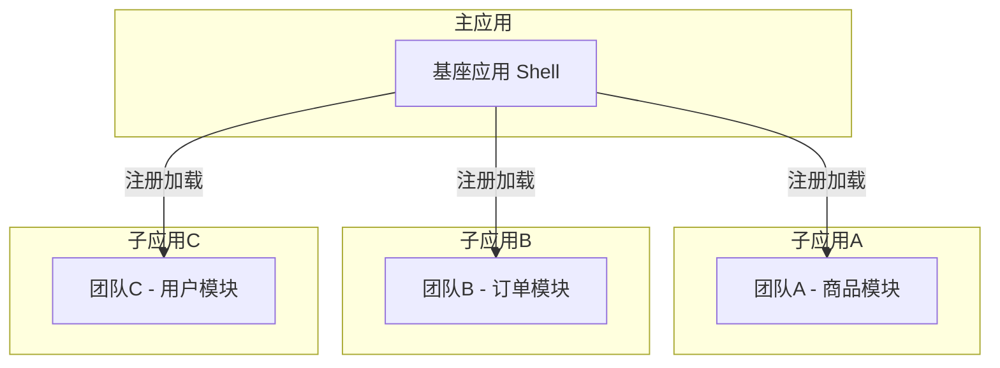

# 微前端概述与核心价值

## 一、什么是微前端

微前端（Micro Frontends）是一种将前端应用拆分为多个更小、更简单的独立应用的架构模式。这些独立应用可以各自独立开发、测试和部署，然后在运行时由主应用统一组装成一个完整的用户界面。

其核心理念来源于后端的微服务架构 — 将庞大单体拆分为松散耦合、独立自治的小型服务，前端同理，将巨型 SPA 拆解为多个可独立交付的微应用。

### 架构示意图



---

## 二、微前端核心特性

### 2.1 技术栈无关

主框架不限制接入应用的技术栈，子应用可自主选择技术栈（Vue、React、Angular、Svelte、原生 JS 等），不同技术栈的应用可以在同一个页面中共存。

```text
主应用（React 18）
├── 子应用A（Vue 3）     ← 技术栈 A
├── 子应用B（React 16）  ← 技术栈 B
├── 子应用C（Angular）   ← 技术栈 C
└── 子应用D（原生 JS）    ← 技术栈 D
```

### 2.2 独立开发与独立部署

各团队拥有独立的代码仓库、独立的 CI/CD 流水线，可以独立进行开发、构建和部署。子应用的发布不影响其他应用和主应用。

### 2.3 增量升级

当一个大型应用变得庞大臃肿后，技术栈升级或重构的代价极高。微前端支持对单个子应用进行渐进式升级，可以从一个子应用开始逐步替换，最终完成整体升级。

### 2.4 独立运行时

各微应用在运行时状态隔离，拥有独立的状态管理（各自的 Vuex/Pinia/Redux），不会相互干扰，一个子应用的崩溃不会导致整个应用崩溃。

---

## 三、微前端解决的痛点

| 痛点 | 传统单体应用 | 微前端方案 |
|------|-------------|-----------|
| **代码耦合** | 多团队共同维护一个代码仓库，容易冲突 | 各团队独立仓库，边界清晰 |
| **构建速度** | 随着应用变大，构建越来越慢 | 各子应用独立构建，增量更新 |
| **技术栈锁定** | 整个应用绑定同一技术栈与版本 | 子应用技术栈自由选型 |
| **部署风险** | 一次部署影响整个应用 | 独立部署，风险隔离 |
| **团队协作** | 多团队协作频繁沟通成本高 | 团队自治，并行开发 |
| **增量重构** | 重构需全量回归测试 | 可按模块逐步迁移 |

---

## 四、适用场景

### 适合使用微前端的场景

- **大型 B 端中后台系统**：多团队维护、模块边界明确
- **需要渐进式技术升级的遗留系统**：逐步从老技术栈迁移到新技术栈
- **多团队并行开发的超级应用**：每个团队负责独立业务线
- **需要跨团队复用的组件/模块**：统一的基础组件由独立团队维护

### 不适合使用微前端的场景

- **小而美的小型应用**：引入微前端反而增加复杂度
- **团队规模小（< 10人）的单一产品**：收益不足以覆盖架构成本
- **对性能极致要求的场景**（如 C 端电商首页）：额外的运行时开销可能影响首屏
- **缺乏团队间协作规范的组织**：微前端需要良好的边界定义和管理规范

---

## 五、核心设计原则

1. **独立部署**：每个微应用应能独立部署上线，不依赖其他应用
2. **隔离性**：应用间的 JS、CSS、状态应充分隔离
3. **标准化通信**：应用间通信应通过标准化的接口/事件机制，而非直接依赖
4. **原生体验**：最终用户感知不到微前端的边界，体验应与单体应用一致
5. **渐进式接入**：应支持对现有老项目的渐进式改造，而非推倒重来

---

## 六、演进历程

```text
2016 ─── Single-SPA 诞生，提出微前端概念
2018 ─── 微前端成为 ThoughtWorks 技术雷达推荐技术
2019 ─── qiankun 发布（阿里），微前端在国内外大规模落地
2020 ─── Webpack 5 Module Federation 发布
2021 ─── micro-app 发布（京东），Web Components 方案流行
2022 ─── 无界发布（腾讯），iframe + Shadow DOM 新思路
2023 ─── Module Federation 2.0 / Rspack 登场
```