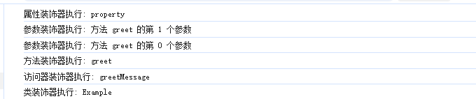

# 🎨 TypeScript 装饰器（Decorator）完全指南

## 📖 概述

装饰器（Decorator）是 TypeScript 中一个强大的特性，它允许我们以声明式的方式修改或增强类、方法、属性或参数的行为。本质上，装饰器是一个函数，通过特定的语法和参数传递，实现对目标的元编程操作。

## 🚀 使用准备

> **版本差异说明**：TypeScript 5.0+ 实现了符合 ECMAScript 标准的装饰器语法，与旧版装饰器存在显著差异。详细了解可参考：[新旧版装饰器对比指南](https://zhuanlan.zhihu.com/p/603820333)

### 配置说明

对于使用旧版装饰器的项目，需在 `tsconfig.json` 中显式启用实验性支持：

```json
{
  "compilerOptions": {
    "experimentalDecorators": true,  // 启用旧版装饰器语法
    "emitDecoratorMetadata": true    // 生成装饰器元数据
  }
}
```

## 📚 装饰器类型与应用

TypeScript 提供了五种类型的装饰器，每种都有其特定的使用场景：

- 类装饰器（Class Decorators）
- 方法装饰器（Method Decorators）
- 访问器装饰器（Accessor Decorators）
- 属性装饰器（Property Decorators）
- 参数装饰器（Parameter Decorators）

### 1. 🏗️ 类装饰器

类装饰器在类声明之前声明，用于监视、修改或替换类定义。

#### 基础示例

```typescript
// 简单的日志装饰器
function classDecorator(constructor: Function) {
  console.log('类装饰器被调用');
  // 可以修改构造函数或原型
  console.log(`装饰的类名: ${constructor.name}`);
  // 可以访问和修改构造函数的属性和方法
}

function addProperties(constructor: Function) {
  // 向原型添加方法
  constructor.prototype.newMethod = function () {
    return '这是通过装饰器添加的新方法';
  };

  // 向原型添加属性
  constructor.prototype.newProperty = '这是通过装饰器添加的新属性';

  // 向类添加静态属性
  constructor.staticProperty = '这是静态属性';
}

@addProperties
@classDecorator
class Example {
  constructor() {
    console.log('Example 类被实例化');
  }

  originalMethod() {
    return '原始方法';
  }
}

// 输出: "类装饰器被调用"
const instance = new Example();
// 输出: "Example 类被实例化"

console.log((instance as any).newProperty); // "这是通过装饰器添加的新属性"
console.log((instance as any).newMethod()); // "这是通过装饰器添加的新方法"
console.log((Example as any).staticProperty); // "这是静态属性"
```

类装饰器可以通过返回一个新的构造函数来完全替换原始类, 并通过这个来监控类的实例化和方法调用, 遵循原型链机制，无法重写方法。也可以返回装饰器工厂方法，也可以返回一个替换类,不过替换的类要与原类结构相同

```typescript
function monitor<T extends { new (...args: any[]): object }>(constructor: T) {
  // 返回一个代理类
  return class extends constructor {
    constructor(...args: any[]) {
      console.log(`创建 ${constructor.name} 的实例，参数:`, args);
      super(...args);
      console.log(`${constructor.name} 实例创建完成`);
    }
  };

  // 替换类
  // return class {
  //   name: string = 'zhangsan';
  //   age: number = 18;
  // };
}

@monitor
class Person {
  constructor(public name: string, public age: number) {
    console.log('Person 构造函数执行');
  }
}

const person = new Person('张三', 30);
// 输出:
// "创建 Person 的实例，参数: ["张三", 30]"
// "Person 构造函数执行"
// "Person 实例创建完成"
```

装饰器工厂函数

```typescript

function withConfig(config: { readonly: boolean }) {
  return function (constructor: Function) {
    Object.defineProperty(constructor.prototype, 'config', {
      value: config,
      writable: !config.readonly,
    });
  };
}

@withConfig({ readonly: true })
class ConfiguredClass {
  constructor() {}
}

const instance = new ConfiguredClass();
(instance as any).config = { readonly: false }; // 错误：属性 'config' 是只读的。
console.log((instance as any).config); // 输出: { readonly: true }

```

#### 实用场景：依赖注入、单例模式

依赖注入

```typescript
type Constructor<T = any> = new (...args: any[]) => T;

// 简单的依赖注入容器
class Container {
  private static instances = new Map<string, any>();

  static register<T>(key: string, instance: T) {
    Container.instances.set(key, instance);
  }

  static get<T>(key: string): T {
    return Container.instances.get(key);
  }
}

// 依赖注入装饰器
function Injectable() {
  return function <T extends Constructor>(constructor: T) {
    Container.register(constructor.name, new constructor());
    return constructor;
  };
}

@Injectable()
class UserService {
  getUsers() {
    // 模拟从数据库获取用户数据
    console.log(this, ': Fetching users from database...');

    return ['User1', 'User2'];
  }
}
@Injectable()
class UserController {
  private userService: UserService;

  constructor() {
    this.userService = Container.get<UserService>('UserService');
  }

  listUsers() {
    return this.userService.getUsers();
  }
}
const userController = Container.get<UserController>('UserController');
console.log(userController.listUsers()); // 输出: ['User1', 'User2']

```

单例模式

```typescript
function singleton<T extends { new (...args: any[]): object }>(constructor: T) {
  // 保存原始构造函数
  const OriginalConstructor = constructor;
  // 创建一个新的函数来管理实例
  const newConstructor: any = function (...args: any[]) {
    // 检查是否已经有实例
    if (!newConstructor.instance) {
      newConstructor.instance = new OriginalConstructor(...args);
    }
    return newConstructor.instance;
  };

  // 复制原型链
  newConstructor.prototype = OriginalConstructor.prototype;

  return newConstructor as T;
}

@singleton
class Database {
  private connectionString: string;

  constructor(connectionString: string) {
    this.connectionString = connectionString;
    console.log(`连接到数据库: ${connectionString}`);
  }

  public query(sql: string) {
    console.log(`执行查询: ${sql}`);
    return `查询结果: ${sql}`;
  }
}

// 创建第一个实例
const db1 = new Database('mongodb://localhost:27017');
// 输出: "连接到数据库: mongodb://localhost:27017"

// 创建第二个实例 - 不会再次连接
const db2 = new Database('mongodb://localhost:27018');
// 没有输出，因为使用的是第一个实例

console.log(db1 === db2); // true - 两个变量引用同一个实例
db1.query('SELECT * FROM users'); // 执行查询: SELECT * FROM users

```

我们借助装饰器，还可以实现类的混入（Mixins），混入的核心思想是将一个或多个源类的功能”混合”到目标类中。与继承不同，混入不建立 “is-a” 关系，而是提供 “has-a” 功能。

```typescript
// 定义构造函数类型
type Constructor<T = object> = new (...args: any[]) => T;

// 创建混入工厂
function Timestamped<TBase extends Constructor>(Base: TBase) {
  return class extends Base {
    timestamp = Date.now();

    getTimestamp(): number {
      return this.timestamp;
    }
  };
}

function Activatable<TBase extends Constructor>(Base: TBase) {
  return class extends Base {
    isActive = false;

    activate(): this {
      this.isActive = true;
      return this;
    }

    deactivate(): this {
      this.isActive = false;
      return this;
    }
  };
}

// 创建装饰器工厂
function ApplyMixins(...mixins: Array<(base: Constructor) => Constructor>) {
  return function <T extends Constructor>(Base: T) {
    return mixins.reduce(
      (AccumulatedBase, Mixin) => Mixin(AccumulatedBase) as T,
      Base
    );
  };
}

// 使用装饰器应用混入
@ApplyMixins(Timestamped, Activatable)
class User {
  constructor(public name: string) {
    this.name = name;
  }

  greet(): string {
    return `Hello, I'm ${this.name}`;
  }
}

// 定义混合后的类型
type MixedUser = User & {
  timestamp: number;
  getTimestamp: () => number;
  isActive: boolean;
  activate: () => MixedUser;
  deactivate: () => MixedUser;
};

const user = new User('李四') as MixedUser;
console.log(user.greet()); // "Hello, I'm 李四"
console.log(user.getTimestamp()); // 时间戳
console.log(user.isActive); // false
user.activate();
console.log(user.isActive); // true

```

#### 类装饰器执行时机

类装饰器在类定义时执行，而不是在类实例化时执行。这意味着装饰器代码会在程序启动时就运行，而不是在创建类实例时运行。

```typescript
function logClass(constructor: Function) {
  console.log(`类 ${constructor.name} 被定义`);
  return constructor;
}

@logClass
class Example {}

console.log('程序开始执行');
```

ps:
类装饰器是 TypeScript 中强大的元编程工具，它允许我们在不修改原始代码的情况下扩展或修改类的行为。通过类装饰器，我们可以实现各种设计模式，如单例、依赖注入、混入等，同时保持代码的清晰和可维护性。

类装饰器的主要优势在于它们提供了一种声明式的方式来添加功能，使代码更具表达力和可读性。在现代 TypeScript 框架中，类装饰器已经成为标准工具，用于实现各种高级功能。

### 2. 📝 方法装饰器

方法装饰器是 TypeScript 装饰器中最常用的类型之一，它应用于类的方法定义，可以用来观察、修改或替换方法的定义。方法装饰器在运行时被调用，可以用来拦截方法的调用、添加额外的行为，或者完全改变方法的实现。

方法装饰器声明在方法声明之前，使用 @expression 形式，其中 expression 必须计算为一个函数，该函数在运行时被调用。

stage3 版本的装饰器函数签名

```typescript
type ClassMethodDecorator = (
  value: Function,
  context: {
    kind: 'method';
    name: string | symbol;
    static: boolean;
    private: boolean;
    access: { get: () => unknown };
    addInitializer(initializer: () => void): void;
  }
) => Function | void;
```

```typescript

function bind(value, { kind, name, addInitializer }) {
  if (kind === 'method') {
    addInitializer(function () {
      console.log('字段被初始化之前被调用');

      this[name] = value.bind(this);
    });
  }
}
class People {
  name;

  constructor(name) {
    console.log('初始化');

    this.name = name;
  }

  @bind
  toString() {
    return `My name is (${this.name})`;
  }
}

const people = new People('ConardLi');
const toString1 = people.toString;

console.log(toString1());

```

#### 🎯 实用场景

##### 1. 性能监控装饰器

```typescript
function measureTime(target: any, { kind, name }) {
  if (kind === 'method') {
    return function (...args: any[]) {
      const start = performance.now();
      const result = target.apply(this, args);
      const end = performance.now();
      console.log(`${name} took ${end - start}ms to execute`);
      return result;
    };
  }
}

class DataProcessor {
  @measureTime
  processData(data: number[]) {
    // 模拟耗时操作
    return data.reduce((a, b) => a + b, 0);
  }
}

const processor = new DataProcessor();
console.log(processor.processData([1, 2, 3, 4, 5])); // 输出：processData took xxxms to execute
```

##### 2. 方法缓存装饰器

```typescript
function memoize(target: any, { kind, name }) {
  if (kind === 'method') {
    const cache = new Map();
    
    return function (...args: any[]) {
      const key = JSON.stringify(args);
      if (cache.has(key)) {
        console.log(`Cache hit for ${name}`);
        return cache.get(key);
      }
      
      const result = target.apply(this, args);
      cache.set(key, result);
      return result;
    };
  }
}

class MathUtils {
  @memoize
  fibonacci(n: number): number {
    if (n <= 1) return n;
    return this.fibonacci(n - 1) + this.fibonacci(n - 2);
  }
}
const mathUtils = new MathUtils();
console.log(mathUtils.fibonacci(10)); // Cache miss, calculates the result
console.log(mathUtils.fibonacci(10)); // Cache hit, returns the cached result
```

##### 3. 权限控制装饰器

```typescript
function requireAuth(role: string) {
  return function(target: any, { kind, name }) {
    if (kind === 'method') {
      return function (...args: any[]) {
        // 模拟检查用户角色
        const currentUserRole = getCurrentUserRole();
        if (currentUserRole !== role) {
          throw new Error(`Unauthorized: Requires ${role} role`);
        }
        return target.apply(this, args);
      };
    }
  };
}

class AdminPanel {
  @requireAuth('admin1')
  deleteUser(userId: string) {
    // 删除用户的逻辑
  }
}
const adminPanel = new AdminPanel();
adminPanel.deleteUser('123'); // 抛出异常
```

##### 4. NestJS路由装饰器

```typescript
// 存储元数据的Map
const routeRegistry = new Map();

// Controller装饰器
function Controller(prefix: string = '') {
  return function (target: any) {
    Reflect.defineMetadata('prefix', prefix, target);
  };
}

// Get请求装饰器
function Get(path: string = '') {
  return function(target: any, { kind, name }) {
    if (kind === 'method') {
      const controllerClass = target.constructor;
      const prefix = Reflect.getMetadata('prefix', controllerClass) || '';
      const route = `${prefix}${path}`;
      
      routeRegistry.set(route, {
        handler: target,
        methodName: name
      });
      
      return target;
    }
  };
}

@Controller('/cats')
class CatsController {
  @Get('/')
  findAll() {
    return ['Persian', 'Siamese', 'Maine Coon'];
  }
  
  @Get('/:id')
  findOne(id: string) {
    return `Cat with id: ${id}`;
  }
}

// 使用示例
const controller = new CatsController();
console.log(routeRegistry); // 输出注册的路由信息
```

##### 5. NestJS守卫装饰器

```typescript
// 守卫接口
interface CanActivate {
  canActivate(context: any): boolean | Promise<boolean>;
}

// 角色守卫
class RolesGuard implements CanActivate {
  constructor(private roles: string[]) {}

  canActivate(context: any): boolean {
    // 模拟获取用户角色
    const userRole = 'admin';
    return this.roles.includes(userRole);
  }
}

// UseGuards装饰器
function UseGuards(...guards: any[]) {
  return function(target: any, { kind, name }) {
    if (kind === 'method') {
      return async function(...args: any[]) {
        // 执行所有守卫
        for (const Guard of guards) {
          const guard = new Guard();
          const canActivate = await guard.canActivate({ target, name });
          if (!canActivate) {
            throw new Error('Forbidden resource');
          }
        }
        return target.apply(this, args);
      };
    }
  };
}

@Controller('/admin')
class AdminController {
  @UseGuards(new RolesGuard(['admin']))
  @Get('/settings')
  getSettings() {
    return { settings: 'Admin settings' };
  }
}

// 使用示例
const admin = new AdminController();
try {
  admin.getSettings();
} catch (error) {
  console.error(error.message);
}
```

### 3. 📝 访问器装饰器

访问器装饰器是 TypeScript 装饰器家族中的一员，专门用于装饰类中的访问器属性（getter 和 setter）。它允许你在不修改原始代码的情况下，拦截、修改或增强访问器的行为。

访问器装饰器声明在访问器声明之前，使用 @expression 形式，其中 expression 必须计算为一个函数，该函数在运行时被调用。

stage3 支持同时装饰 getter 和 setter, TypeScript5.0以下对访问器装饰器有一些限制

#### 1. 日志装饰器

```typescript
function logAccess(value: Input, context: Record<string, any>) {
  // console.log(value, context);

  if (context.kind === 'getter') {
    // 修改 getter
    return function () {
      console.log(`获取 ${context.name} 的值`);
      const result = value.call(this);
      return result;
    };
  }
  if (context.kind === 'setter') {
    // 修改 setter
    return function (newValue: string) {
      console.log(`设置 ${context.name} 的值为: ${newValue}`);
      value.call(this, newValue);
    };
  }
}
class Person {
  private _name: string;

  constructor(name: string) {
    this._name = name;
  }

  @logAccess
  get name(): string {
    return this._name;
  }

  set name(value: string) {
    this._name = value;
  }
}
const person = new Person('张三');
console.log(person.name); // 输出: 获取 name 的值, 张三
person.name = '李四'; // 输出: 设置 name 的值为: 李四
console.log(person.name); // 输出: 获取 name 的值, 李四
```

#### 2. 缓存装饰器

```typescript
function lazy(value, { kind, name, addInitializer }) {
  if (kind === 'getter') {
    return function () {
      const result = value.call(this);

      // 给当前实例对象(this)加上value属性，并且不可修改
      Object.defineProperty(this, name, {
        value: result,
        writable: false,
      });
      return result;
    };
  }
}

class People {
  @lazy
  get value() {
    console.log('一些计算。。。');
    return '计算后的结果';
  }
}

const inst = new People();
console.log('1 inst.value', inst.value);
console.log('2 inst.value', inst.value);
```

#### 3.参数装饰器

带参数的访问器装饰器（setter/getter）可以通过装饰器工厂函数实现。

```typescript
function validateLength(...args) {
  return function (value, { kind, name, addInitializer }) {
    // console.log({ value, kind, name, addInitializer });
    if (kind === 'setter') {
      return function (newValue) {
        const [min, max] = args;
        if (newValue.length < min) {
          throw new Error(`${name} 长度不能小于 ${min}`);
        }

        if (newValue.length > max) {
          throw new Error(`${name} 长度不能大于 ${max}`);
        }
        value.call(this, newValue);
      };
    }
  };
}

class User {
  private _username: string;

  constructor(username: string) {
    this._username = username;
  }

  get username(): string {
    return this._username;
  }

  @validateLength(3, 20)
  set username(value: string) {
    this._username = value;
  }
}

const user = new User('admin');
console.log(user.username); // admin

try {
  user.username = 'a'; // 抛出错误
} catch (error) {
  if (error instanceof Error) {
    console.error(error.message); // username 长度不能小于 3
  }
}

try {
  user.username = 'a'.repeat(30); // 抛出错误
} catch (error) {
  if (error instanceof Error) {
    console.error(error.message); // username 长度不能大于 20
  }
}

user.username = 'moderator'; // 有效
console.log(user.username); // moderator

```

### 4. 📝 属性装饰器

属性装饰器是 TypeScript 装饰器家族中的一员，用于装饰类的属性（非方法）。它允许你在不修改原始代码的情况下，监控、修改或增强类属性的行为。

属性装饰器声明在属性声明之前，使用 @expression 形式，其中 expression 必须计算为一个函数，该函数在运行时被调用。

属性装饰器可以应用在数据验证、日志记录、依赖注入等不同场景下

```typescript
// 模拟依赖注入容器
const serviceContainer = new Map();

function Inject(serviceName: string) {
  return function (value: any, { kind, name, addInitializer }) {
    if (kind === 'field') {
      addInitializer(function () {
        const getter = () => {
          return serviceContainer.get(serviceName);
        };

        Object.defineProperty(this, name, {
          get: getter,
        });
      });
    }
  };
}

// 注册服务
serviceContainer.set('logger', { log: (msg: string) => console.log(msg) });

class App {
  @Inject('logger')
  logger: any;
}

const app = new App();
app.logger?.log('Hello from injected logger!');
console.log(app.logger);

```

### 5. 📝 参数装饰器

参数装饰器是 TypeScript 装饰器家族中较为特殊的一员，它应用于类构造函数或方法的参数声明。参数装饰器主要用于收集关于参数的元数据，通常与其他装饰器配合使用，特别是在依赖注入系统中。

参数装饰器声明在参数声明之前，使用 @expression 形式，其中 expression 必须计算为一个函数，该函数在运行时被调用。

现阶段TypeScript并不支持。如果需要兼容，可以开启experimentalDecorators的配置项

```typescript
function parameterDecorator(validationFn: (value: any) => boolean) {
  return function (target: any, methodName: string, parameterIndex: number) {
    console.log(
      `类 ${target.constructor.name} 的方法 ${methodName} 的第 ${parameterIndex} 个参数被装饰`
    );
  };
}

class UserService {
  createUser(
    @parameterDecorator((name) => name.length >= 3)
    name: string,
    @parameterDecorator((age) => age >= 18)
    age: number
  ) {
    console.log(`创建用户: ${name}, ${age}岁`);
  }
}

const service = new UserService();
service.createUser('Alice', 25);
service.createUser('Bob', 17);

```

## ⚡ 装饰器执行时机

方法装饰器在类定义时执行，而不是在方法调用时执行。装饰器函数会在类被定义时立即执行，但是装饰器返回的包装函数会在每次方法调用时执行。

装饰器的执行顺序如下所示:

这个执行顺序的规律是：

1. 属性装饰器优先执行
2. 参数装饰器在其所属方法的装饰器之前执行，且从右到左
3. 方法装饰器在其参数装饰器之后执行
4. 访问器装饰器在方法装饰器之后执行
5. 类装饰器最后执行

这与 TypeScript 装饰器的设计原则相符，确保成员（属性、参数、方法）的装饰器在类装饰器之前执行参数装饰器在其所属方法的装饰器之前执行，从内到外的执行顺序。

```typescript
// 类装饰器
function classDecorator(target: Function) {
  console.log('类装饰器执行:', target.name);
}
 
// 方法装饰器
function methodDecorator(target: any, propertyKey: string, descriptor: PropertyDescriptor) {
  console.log(`方法装饰器执行: ${propertyKey}`);
}
 
// 访问器装饰器
function accessorDecorator(target: any, propertyKey: string, descriptor: PropertyDescriptor) {
  console.log(`访问器装饰器执行: ${propertyKey}`);
}
 
// 属性装饰器
function propertyDecorator(target: any, propertyKey: string) {
  console.log(`属性装饰器执行: ${propertyKey}`);
}
 
// 参数装饰器
function parameterDecorator(target: any, methodName: string, parameterIndex: number) {
  console.log(`参数装饰器执行: 方法 ${methodName} 的第 ${parameterIndex} 个参数`);
}
 
@classDecorator
class Example {
  @propertyDecorator
  public property: string;
 
  constructor(property: string) {
    this.property = property;
  }
 
  @methodDecorator
  greet(@parameterDecorator name: string, @parameterDecorator age: number) {
    console.log(`Hello, ${name}. You are ${age} years old.`);
  }
 
  @accessorDecorator
  get greetMessage() {
    return 'Hello, world!';
  }
}
```

## 🔍 常见问题解答

**Q: 装饰器和继承有什么区别？**
A: 装饰器是一种非侵入式的方式来增强类的功能，而继承建立了一种 is-a 关系。装饰器更适合横切关注点的处理。

**Q: 装饰器会影响性能吗？**
A: 装饰器主要在类定义时执行，对运行时性能影响较小。但过度使用装饰器可能影响启动性能。

**Q: 如何调试装饰器？**
A: 可以在装饰器函数中添加断点或日志，使用 TypeScript 的 sourceMap 功能辅助调试。
