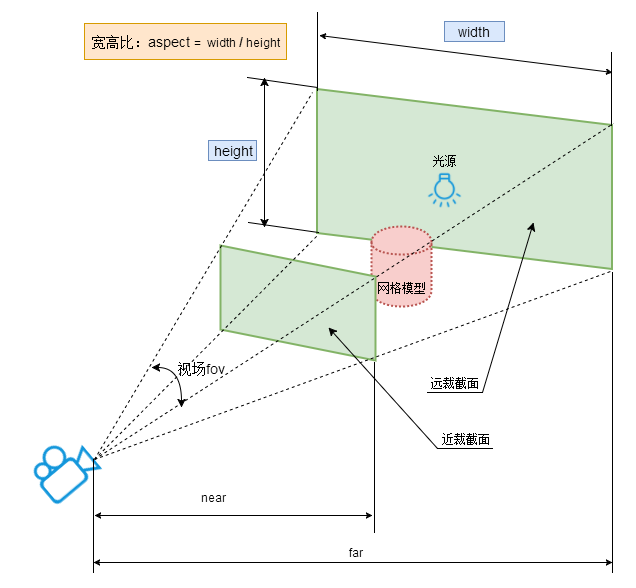
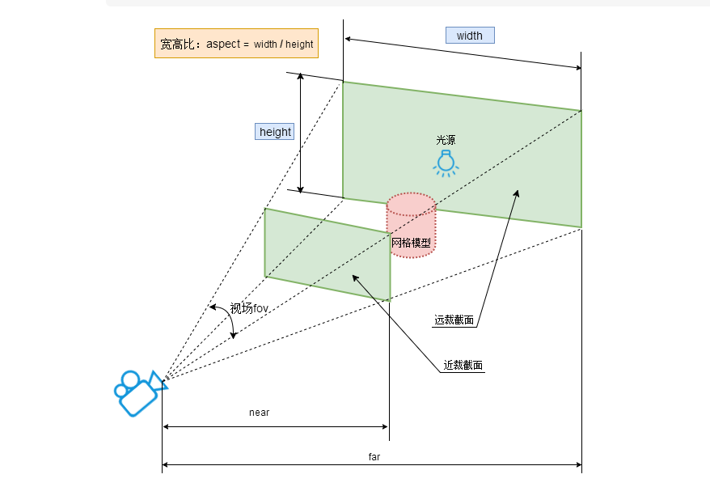

# 🏗️ 场景搭建基础

## 1. 🌍 场景（Scene）概述

可以把三维场景Scene (opens new window)对象理解为虚拟的3D场景，用来表示模拟生活中的真实三维场景,或者说三维世界。

- 物体形状：几何体Geometry
- 物体外观：材质Material
- 物体：网格模型Mesh
- 模型位置 .position
- 添加到场景中 .add()方法

## 2. 📷 相机（Camera）

- 透视投影相机（PerspectiveCamera）
- 正交相机（OrthographicCamera）
- 相机参数设置
- 相机位置和朝向

### 2.1 透视投影相机（PerspectiveCamera）

透视投影相机的四个参数fov, aspect, near, far构成一个四棱台3D空间，被称为视锥体，只有视锥体之内的物体，才会渲染出来，视锥体范围之外的物体不会显示在Canvas画布上。


PerspectiveCamera参数介绍：

```javascript
PerspectiveCamera( fov, aspect, near, far )
```

| 参数 | 含义 | 默认值 |
|------|------|--------|
| fov | 相机视锥体竖直方向视野角度 | 50 |
| aspect | 相机视锥体水平方向和竖直方向长度比，一般设置为Canvas画布宽高比width / height | 1 |
| near | 相机视锥体近裁截面相对相机距离 | 0.1 |
| far | 相机视锥体远裁截面相对相机距离，far-near构成了视锥体高度方向 | 2000 |

## 3. 🎨 渲染器（Renderer）

- WebGLRenderer的创建和配置
- 渲染循环
- 渲染器参数设置
- 响应式渲染

## 4. 🚀 创建一个立方体

### 4.1 创建场景

```javascript
// 创建3D场景对象Scene
const scene = new THREE.Scene();

{
  // 创建一个长方体几何对象Geometry
  const geometry = new THREE.BoxGeometry(1, 100, 100);
  //创建一个材质对象Materia
  const material = new THREE.MeshBasicMaterial({ color: new THREE.Color("orange"), });
  //网格模型对象Mesh
  const mesh  = new THREE.Mesh(geometry, material);
  //设置网格模型在三维空间中的位置坐标，默认是坐标原点
  mesh.position.set(0, 0, 0);
  // 把物体添加到场景中
  scene.add(mesh);
}
```

### 4.2 设置相机

```javascript
// 定义相机输出画布的尺寸(单位:像素px)
const width = window.innerWidth;
const height = window.innerHeight;
// 实例化一个透视投影相机对象
const camera = new THREE.PerspectiveCamera(60, width / height, 0.1, 1000);

{
  // 设置相机位置，使其可以观察到几何体
  camera.position.set(200, 200, 200);
  //相机观察目标指向Threejs 3D空间中某个位置
  camera.lookAt(0, 0, 0);
  // camera.lookAt(mesh.position);//指向mesh对应的位置
}
```

### 4.3 创建渲染器

```javascript
{
  // 实例化一个渲染器对象
  const renderer = new THREE.WebGLRenderer({ antialias: true });
  // 定义threejs输出画布的尺寸(单位:像素px)
  renderer.setSize(window.innerWidth, window.innerHeight);
  renderer.setPixelRatio(window.devicePixelRatio);
  // 设置渲染器输出的Canvas画布的背景颜色
  renderer.setClearColor(0x000000);
  function render() {
    renderer.render(scene, camera); //执行渲染操作
    requestAnimationFrame(render);
  }
  render();
  // 把渲染器生成的Canvas画布内容添加到body元素中
  document.body.appendChild(renderer.domElement);
  
  //   监听了 canvas 元素的 pointer、contextmenu、wheel 等鼠标事件，内部修改 camara 参数就可以
  const controls = new OrbitControls(camera, renderer.domElement);
}
```

## 5. 坐标辅助器与轨道控制器

坐标辅助器：

坐标轴颜色红R、绿G、蓝B分别对应坐标系的x、y、z轴，对于three.js的3D坐标系默认y轴朝上;
设置模型在坐标系中的位置或尺寸;
改变相机参数



```javascript
//设 置材质半透明,这样可以看到坐标系的坐标原点。
const material = new THREE.MeshBasicMaterial({ 
  color: new THREE.Color("orange"),
  transparent:true,//开启透明
  opacity:0.5,//设置透明度
  });

// 相机放在x轴负半轴，目标观察点是坐标原点，这样相当于相机的视线是沿着x轴正方向，只能看到长方体的一个矩形平面。
camera.position.set(-1000, 0, 0);
camera.lookAt(0, 0, 0);
// 相机视线沿着x轴负半轴，mesh位于相机后面，自然看不到
camera.position.set(-1000, 0, 0);
camera.lookAt(-2000, 0, 0);

// 相机far偏小，mesh位于far之外，物体不会显示在画布上。

// const camera = new THREE.PerspectiveCamera(30, width / height, 1, 3000);
// 你可以进行下面测试，改变相机参数，把mesh放在视锥体之外，看看是否显示
// 3000改为300，使mesh位于far之外，mesh不在视锥体内，被剪裁掉
const camera = new THREE.PerspectiveCamera(30, width / height, 1, 300);

{
  // 创建一个辅助观察的坐标轴
  const axisHelper = new THREE.AxesHelper(100);
  // 添加到场景中
  scene.add(axisHelper);
}
```

轨道控制器(OrbitControls)：

平时开发调试代码，或者展示模型的时候，可以通过相机控件OrbitControls实现旋转缩放预览效果。

OrbitControls本质上就是改变相机的参数，比如相机的位置属性，改变相机位置也可以改变相机拍照场景中模型的角度，实现模型的360度旋转预览效果，改变透视投影相机距离模型的距离，就可以改变相机能看到的视野范围。

- 旋转：拖动鼠标左键
- 缩放：滚动鼠标中键
- 平移：拖动鼠标右键

引入扩展库OrbitControls.js

注意：如果你在原生.html文件中，使用引入方式`three/addons`，注意`<script type="importmap">`配置'three/addons'映射。

```javascript
// 引入轨道控制器扩展库OrbitControls.js
import { OrbitControls } from 'three/addons/controls/OrbitControls.js';


<script type="importmap">
    {
  "imports": {
   "three": "../../../three.js/build/three.module.js",
      "three/addons/": "../../../three.js/examples/jsm/"
  }
 }
</script>
```

## 6. ✨ 应用lil-gui(Dat.gui)调试开发3D效果

Dat.gui是一个可视化调试工具，可以方便学习开发，借助dat.gui.js可以快速创建控制三维场景的UI交互界面
gihtub地址：<https://github.com/dataarts/dat.gui>

```javascript
// 引入dat.gui.js的一个类GUI
import { GUI } from 'three/addons/libs/lil-gui.module.min.js';
```

.domElement：改变GUI界面默认的style属性

```javascript
//改变交互界面style属性
gui.domElement.style.right = '0px';
gui.domElement.style.width = '300px';
```

Controller对象实例方法

- addColor：添加一个颜色控制项
- name：分组名称
- onChange：监听值变化
- step：步长
- min：最小值
- max：最大值

```javascript
meshFolder.add(mesh.position, 'x').step(1).min(-100).max(100).name('位置').onChange((value) => {
  // 跟着x同步变化
  mesh.position.y = value;
});

lightFolder.add(pointLight, 'intensity', 0, 10000).name('环境光强度').step(100);; // 光照强度属性.intensity
lightFolder.add(pointLight.position, 'x').step(1).min(-100).max(100)

```

gui改变threejs光照强度、模型位置测试

```javascript
const meshFolder = gui.addFolder('网格');
meshFolder.addColor(mesh.material, 'color');
meshFolder.add(mesh.material, 'opacity', 0, 1, 0.1);
meshFolder.add(mesh.position, 'x').step(1).min(-100).max(100);

const lightFolder = gui.addFolder('灯光');
lightFolder.addColor(pointLight, 'color');
lightFolder.add(pointLight, 'intensity', 0, 10000, 100); // 光照强度属性.intensity
lightFolder.add(pointLight.position, 'x').step(1).min(-100).max(100);

```

gui交互界面分组

- 分组 addFolder
- 折叠菜单 close、open
- 子菜单支持嵌套菜单

```javascript
  const lightFolder = gui.addFolder('灯光');
  lightFolder.add(pointLight, 'intensity', 0, 10000, 100); // 光照强度属性.intensity
  lightFolder.add(pointLight.position, 'x').step(1).min(-100).max(100);
  lightFolder.close();//关闭菜单
  const colorFolder = lightFolder.addFolder('颜色');//子菜单的子菜单
  colorFolder.addColor(pointLight, 'color');
  colorFolder2.close();//关闭菜单

```

gui 其他控件类型

- .add()方法参数3和4数据类型是数字，交互界面是拖动条，可以在一个区间改变属性的值
- .add()方法参数3数据类型是数组，交互界面是下拉菜单
- .add()方法参数3数据类型是对象，交互界面是下拉菜单
- .add()方法对应属性的数据类型是布尔值，交互界面是单选框
- .add()改变属性的对应的数据类型是函数，会直接触发

```javascript
const otherFolder = gui.addFolder('其他控件类型');

const obj = {
    aaa: '天王盖地虎',
    bbb: false,
    ccc: 0,
    ddd: '111',
    fff: 'Bbb',
    logic: function () {
      alert('执行一段逻辑!');
    }
};

otherFolder.add(obj, 'aaa').onChange((value) => {
    console.log(value);
});

otherFolder.add(obj, 'bbb');
otherFolder.add(obj, 'ccc').min(-10).max(10).step(0.5);
otherFolder.add(obj, 'ddd', [ '111', '222', '333' ] );
otherFolder.add(obj, 'fff', { Aaa: 0, Bbb: 0.1, Ccc: 5 } );
otherFolder.add(obj, 'logic');
```
