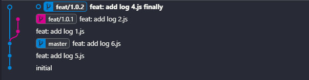

****# Git 基础知识

## 常用命令

| 命令                      | 简要说明                      |
| ------------------------- | ----------------------------- |
| git clone 仓库地址        | 克隆版本库                    |
| git status                | 查看状态                      |
| git add .                 | 添加至暂存区                  |
| git commit -m '说明'      | 提交并添加说明                |
| git push -u origin master | 推送至远程仓库 master 分支    |
| git branch -a             | 列出所有分支                  |
| git branch dev            | 创建 dev 分支                 |
| git checkout dev          | 切换到 dev 分支               |
| git merge dev             | 把 dev 分支合并到 master 分支 |
| git branch -d dev         | 删除 dev 分支                 |
| git pull origin master    | 同步分支到本地                |
| git reset --hard 版本号   | 获取历史版本                  |
| git remote add origin xxx | 关联远程仓库                  |

## 基本操作

```bash
git init

## 跟踪文件｜将改动放入暂存区
# 当前目录下的所有，不包括.gitignore中的文件或目录
git add . 
# 指定目录
git add dirPath
# 指定文件
git add filePath
# 指定多个文件
git add file1Path file2Path

# 将改动从暂存区中移除
git restore filename

# 撤销工作区指定文件的修改
# 还原到最近的commit状态
git checkout filename

# 将暂存区的内容提交到本地仓库
git commit -m "you can diy here content"

# 查看工作区当前状态
git status

## 查看commit日志,提交历史
git log
# 带图像的查看
git log --graph

# 查看查看命令历史
git reflog

## 查看指定文件的改动了哪些
git diff filename
# 查看工作区指定的文件与版本库中最新的代码有何区别
git diff HEAD -- filename

## 回退到之前的commit
# tips：
# HEAD表示当前版本
# HEAD^表示前一版本
# HEAD^^表示前两个版本，依次类推
# 当前的修改不会丢弃
git reset HEAD^

# 丢弃当前的更改
git reset HEAD^ --hard

## 删除文件相关

# 从本地仓库中取回被删除的文件
git checkout filename
# 命令本质的作用就是用最新的commit中的文件替换当前的文件

# 从本地仓库中删除指定的文件
git rm filename
# 删除后需要commit过后才生效
git commit -m "del: delete a filename"
# 在commit之前想要恢复的话
# 第一步，先把修改弄到暂存区
git restore --staged filename
# 第二步，撤销暂存区的修改
git restore filename
```

## 分支管理

创建和切换

```shell
# 创建 dev 分支
git branch dev

# 切换到 dev 分支
git checkout dev

# 创建 dev 分支并切换到 dev 分支
git pull remoteName branchName

```

合并分支

```shell
# 先切换为 master 分支
git checkout master

# 合并分支 把 dev 分支合并到 master 分支
git merge dev

# 将合并的分支提交到仓库
git push

# 快速合并
# 将otherBranch分支合并到当前的分支
# 快速合并看不出来做过改动
git merge otherBranch
# 合并其它分支，将变动都放入暂存区，不合并commit
git merge otherBranch --squash
# 禁用快速合并
git merge --no-ff -m "commit msg" otherBranch
# 舍弃合并，尝试恢复到你运行合并前的状态
git merge --abort
```

**更改分支名**
>checkout 既可以切换分支又可以撤销修改，容易造成歧义，所以切换分支可以使用switch

```shell
# 修改本地分支名称：
git branch -m oldBranchName newBranchName

# 将改名后的本地分支推送到远程，并将本地分支与之关联
git push --set-upstream origin newBranchName

# 删除本地分支
git branch -d branchName

## switch
# 切换分支
git switch branchName
# 创建并切换
git switch -c newBranchName
```

**合并其它分支的某个commit到当前分支**

```bash
# 单个commit的cherry-pick
git cherry-pick commit_id

# 多个连续commit的cherry-pick（不包含first_commit_ID）
git cherry-pick first_commit_ID..last_commit_ID

# 多个连续commit的cherry-pick（包含first_commit_ID）
git cherry-pick first_commit_ID^..last_commit_ID

# 多个不连续commit的cherry-pick
git cherry-pick commit_id_1 commit_id_2 commit_id_3
```

如果在cherry-pick过程中遇到冲突：

1. 解决冲突
2. 使用 `git add` 添加解决冲突后的文件
3. 使用 `git cherry-pick --continue` 继续执行
4. 如果想要放弃cherry-pick，使用 `git cherry-pick --abort`

**变基**
>rebase操作可以把本地未push的分叉提交历史整理成直线

```bash
git rebase branchName


```

## 回溯版本

查看 `commit hash` 值

```shell
git reflog
```

回溯版本

```shell
git reset --hard xxxx
```

回溯命令

```shell
git push -f
```

## 配置 Git SSH Key

命令行输入：

```shell
ssh-keygen -t rsa -b 4096 -C "邮箱"
```

连续敲击 3 次回车，即可 `/c/Users/` 当前用户`/.ssh/` 目录中生成 `id_rsa` 和 `id_rsa.pub` 两个文件

## 远程仓库

```shell

# 关联远程仓库
git remote add remoteName address
# remoteName 可以自行定义，可以关联多个远程仓库
# 一般主要的remote 使用 origin命名

# 只显示名称
git remote
# 显示远程仓库的地址
git remote -v

# 删除关联的远程仓库
git remote remove remoteName
# 重命名关联的远程仓库
git remote rename oldRemoteName newRemoteName

# 本地分支推到远程仓库
# 全写
git push remoteName localBranchName:remoteBranchName
# 简写(这种情况默认本地与远程分支名称一致)
git push remoteName branchName

```

**设置上游分支**

```shell
git push -u remoteName branchName 
# 设置上游分支后
# 本地在push的时候就可以直接执行
git push
# 等价于
git push remoteName branchName

# 克隆远程仓库到本地
git clone remoteAddress

## 更新本地的分支列表

# 更新所有的远程仓库的
git fetch -all
# 更新指定远程仓库
git fetch remoteName

# 拉取/合并远程的分支到本地
git pull remoteName branchName
```

## stash

>将工作区未提交的内容先存储起来

```bash
# flagName 用于标示每次的stash操作
git stash save flagName

# 查看贮藏的列表
git stash list

# 恢复贮藏的内容
git stash pop stash_id
# or
git stash apply stash_id
# stash_id通过git stash list 获取
# 区别
# pop会在恢复后删除指定的stash
# apply不会删除
```

## 标签

>给指定的commit打上一个标签，便于寻找关键的commit

```bash
# 默认为最新的commit打上tag
git tag v0.0.0
git tag youlikeText

# 为指定的commit 打上tag
git tag youlikeText commit_id
# commit_id通过git log获取

# 创建带有说明的标签
git tag -a tagName -m "description" comment_id
# 查看所有标签
git tag
# 将本地的tag提交到远程仓库
git push --tag
```

## 修改用户名和邮箱

输入命令：

```shell
git config --global user.name 'xxxxx'
git config --global user.email 'xxxxx@qq.com'
```

## 合并两个没有共同历史提交记录的分支

某个git仓库原有master分支，后面自己本地新建了一个项目，然后把新建的这个推到了这个仓库的另外一个分支temp
直接合并报错`fatal: refusing to merge unrelated histories`

**解决方案**：采用git rebase --onto变基的方法

1.先从master上拉出一个新的分支dev进行操作,并推到远程

`git checkout -b dev`

`git push --set-upstream origin dev` //推送并关联远程分支

2.执行`git rebase --onto temp`进行变基操作


3.在该分支上拉取允许不相关历史的操作,然后手动解决冲突

`git pull --allow-unrelated-histories`


4.解决冲突，提交推送到远程

```bash
npm config set registry http://registry.npmmirror.com

https://registry.npmjs.org

```

**ssh**

`ssh-keygen -t ed25519 -C "1395568275@qq.com" -f ~/.ssh/id_ed25519_mcwmengxi`

config

```bash
# github
Host github.com
HostName ssh.github.com
User mcwmengxi
IdentityFile ~/.ssh/id_ed25519_mcwmengxi
PreferredAuthentications publickey
Port 443

```

sourcetree添加ssh秘钥
`ssh -T git@github.com`

解除ssh验证

`git config --global http.sslVerify false`

## 用户账号管理

>如果在项目自己的配置文件中已经有了用户名的配置，则优先使用项目自己的配置。如果项目没有单独配置，则再根据当前根路径是否指定了配置文件去获取对应的配置信息

**管理同一目录下的配置**

目录下建立`.gitconfig`

```bash
[user]
  name = mcwmengxi
  email = 1395568275@qq.com
```

修改git的全局配置文件.gitconfig,把当前目录添加全局配置文件中

```bash
[includeIf "gitdir:D:/project/"]
  path = D:/project/.gitconfig
```

**单独配置项目用户名**

```bash
git config user.name mcwmengxi 
git config user.email 1395568275@qq.com 
```

## git代理

`.gitconfig`文件开启代理,访问`github,git`仓库走`ssh`

```
[http]
  proxy = http://127.0.0.1:26501
  sslverify = false # 禁用 SSL 安全证书检查
```

## 实际场景使用git

[**sourceTree无法打开**](https://zhuanlan.zhihu.com/p/637566727)

```bash
ERROR [1] [Sourcetree.Composition.VSMef.Net48.VSMefCompositionManager] [Log] - Unable to load MEF components
```

删除该目录下两个.cache文件 Composition.cache Assemblies.cache

`C:\Users\mengxi\AppData\Local\Atlassian\SourceTree.exe_Url_fop3hzd4ikr21gr5nqmqd4tnru2hl5kn\3.4.12.0`

**移除本地分支与远程的关联**

```bash
# 1.查看分支的远程关联
git branch -vv

# 2.移除远程关联
git branch --unset-upstream

git branch -vv
```

**多个提交合并成一个**

```bash
# 1.查看提交记录
git log -8 --oneline

# 2.选择合并范围 假设你想要合并最近的四个commits
git rebase -i HEAD~4

# 3.进行交互式变基 在打开的编辑器中，你会看到一列commit列表，每个commit前都有一个命令提示符，默认是pick。要将多个commits合并为一个，你需要将除了第一个commit之外的其他commit前的pick改为squash或者s。这告诉Git要将这些commits与前一个commit合并。

# 4.按esc退出编译模式，按大写ZZ保存并关闭编辑器，Git会开始rebase的过程。如果有需要，它会停下来让你解决合并期间产生的冲突。

# 5.编辑合并后的提交信息 Git将会打开一个新的编辑器窗口，让你编辑最终的提交信息。

# 6.查看合并后日志并推送到远程
git log --oneline
git push --force 
```

**风险代码合入回滚**

1.风险代码提交了 Commit ，但未推至远程

```bash
# 1.撤销提交到暂存区
git log
git reset --soft xxx

# 2.直接撤销
git reset --hard xxx
```

2.风险代码已经推送至远程分支，但未合入

```bash
# 风险代码提交推送到远程
git commit -m "xxxx"
git push

# 直接修复，并覆盖 上次commit
git commit --amend
git push --force-with-lease origin git-reset-test
```

```bash
# fatal: The current branch git-reset-test has no upstream branch.
# 该分支没有设置上游分支
git push --set-upstream origin git-reset-test
# 如果您希望 Git 在将来自动为没有跟踪上游的分支设置远程分支，可以配置 push.autoSetupRemote 选项
git config --global push.autoSetupRemote true
```

ps: 需要注意的是，这里的强推需要避免使用 git push -f，在多人合作场景下，push -f可能会覆盖其他人的代码，而 push --force-with-lease 是一种更安全的强推做法，如果强推阶段的本地 git tree 落后于远端 git tree，push --force-with-lease会禁止强推，并引导你完成本地内容的同步后再进行后续操作。

**存在风险代码的远程分支合入了主分支**

>如果存在风险的代码分支已经合入了主分支，这种需要第一时间进行回滚止损。与非主分支的回滚不同，主分支应该禁用直接的强推操作，我们需要使用 revert 完成分支的回滚。

```bash
git log
# 与reset回滚不同的是，revert会创建一个新的commit用来撤销之前变更的内容，常用于主分支的回滚场景。
git revert xxx
```

**git rebase 让你的提交记录更加清晰可读**

1.git rebase 的使用

假设我们现在有2条分支，一个为 master，一个为 feat/1.0.1，他们都基于初始的一个提交 add readme 进行检出分支，之后，master 分支增加了 3.js 和 4.js 的文件，分别进行了2次提交，feat/1.0.1 也增加了 1.js 和 2.js 的文件，分别对应以下2条提交记录。

此时，切换到 feature/1 分支下，执行 git rebase master，成功之后，通过 `git log` 查看记录。以 `master` 分支最后的提交作为基点，再逐个应用 `feat/1.0.1` 的每个更改。



大部分情况下，rebase 的过程中会产生冲突的，此时，就需要手动解决冲突，然后使用依次 `git add`  、`git rebase --continue`  的方式来处理冲突，完成 rebase 的过程，如果不想要某次 `rebase` 的结果，那么需要使用 `git rebase --skip`  来跳过这次 rebase 操作。

`git cherry-pick` 冲突时的解决方法也与此类似

2.git rebase 交互模式

合并本地多个重复功能提交, 使git提交记录更简洁

`git rebase -i ac18084`

想要合并这一堆更改，我们要使用 Squash 策略进行合并，即把当前的 commit 和它的上一个 commit 内容进行合并， 大概可以表示为下面这样，在交互模式的 rebase 下，至少保留一个 pick，否则命令会执行失败。

```bash
pick  ... ...
s     ... ... 
s     ... ... 
s     ... ... 

```

修改文件后 按下 : 然后 wq 保存退出，此时又会弹出一个编辑页面，这个页面是用来编辑提交的信息，修改为 feat: 更正，最后保存一下

**配置 `git alias` 提升工作效率**

更新你全局的 .gitconfig 文件，该文件用来保存全局的 git 配置，vim ~/.gitconfig

```bash

[alias]
st = status -sb
co = checkout
br = branch
mg = merge
ci = commit
ds = diff --staged
dt = difftool
mt = mergetool
last = log -1 HEAD
latest = for-each-ref --sort=-committerdate --format=\"%(committername)@%(refname:short) [%(committerdate:short)] %(contents)\"
ls = log --pretty=format:\"%C(yellow)%h %C(blue)%ad %C(red)%d %C(reset)%s %C(green)[%cn]\" --decorate --date=short
hist = log --pretty=format:\"%C(yellow)%h %C(red)%d %C(reset)%s %C(green)[%an] %C(blue)%ad\" --topo-order --graph --date=short
type = cat-file -t
dump = cat-file -p
lg = log --color --graph --pretty=format:'%Cred%h%Creset -%C(yellow)%d%Creset %s %Cgreen(%cr) %C(bold blue)<%an>%Creset' --abbrev-commit

```
